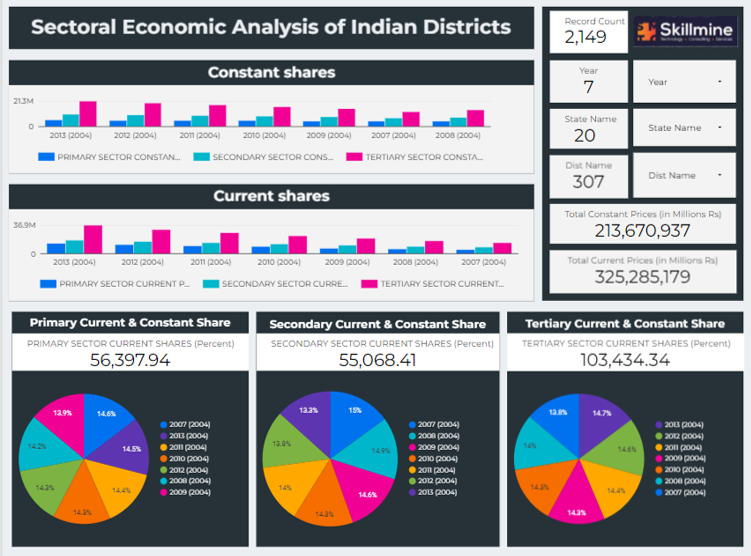

# 📊 District-Wise Sectoral Analysis of Indian States  

## 🔍 Problem Statement  
Understanding regional economic distribution is crucial for policy-making and business decisions.  
However, identifying **which sectors dominate specific districts** and how economic activity varies across regions is not straightforward.

This project analyzes district-level sectoral data across Indian states to uncover **patterns, disparities, and growth opportunities**.

---

## 🎯 Objective  
- Analyze sector-wise contribution across districts  
- Identify dominant sectors in different regions  
- Compare economic patterns across states  
- Generate insights for economic and business understanding  

---

## 🛠️ Tools & Technologies  
- SQL (Data Analysis)  
- Excel / Looker Studio (Validation & Visualization)  
- Dataset: District-wise sectoral data (India)  

---

## 📊 Key Analysis Performed  

- Sector-wise distribution across districts  
- Identification of dominant sectors by region  
- Comparative analysis across states  
- Pattern detection using SQL queries  

---

## 📈 Key Insights  

- Certain districts show strong dependency on a single sector  
- Significant variation exists in economic structure across states  
- Some regions demonstrate balanced multi-sector growth  
- Sector dominance can indicate regional specialization and development gaps  

---

## 💡 Business Implications  

- Helps identify **high-growth sectors in specific regions**  
- Useful for **investment and expansion decisions**  
- Supports **policy-making and regional planning**  
- Highlights **economic imbalances across districts**  

---

## 🗂️ Project Structure  

- `dataset.csv` → Raw data  
- `analysis.sql` → SQL queries  
- `report.pdf` → Detailed analysis  
- `presentation.pptx` → Summary insights  

---

## 📊 Sample Visualizations 

## ▶️ How to Run  

1. Load dataset into SQL environment  
2. Execute queries from `analysis.sql`  
3. Analyze outputs  
4. Refer to report/presentation for insights  

---

## 👤 Author  
**Harshit Saraf**  
PGDM – Business Analytics  
